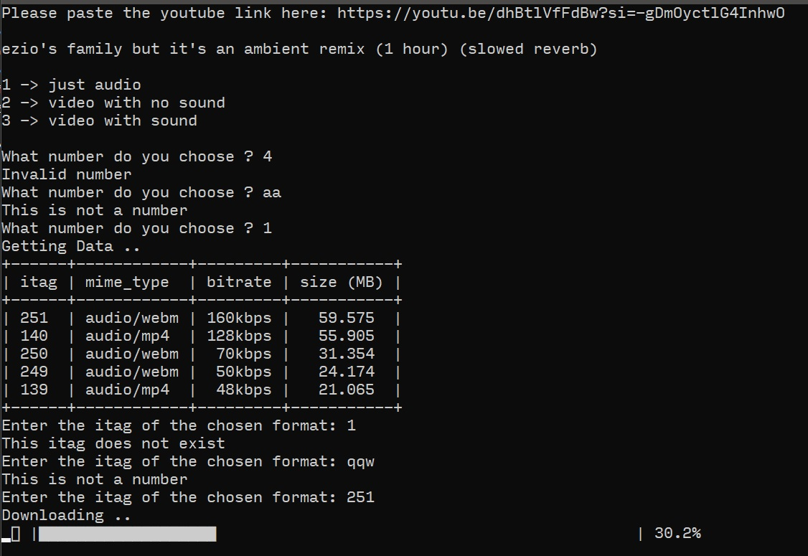
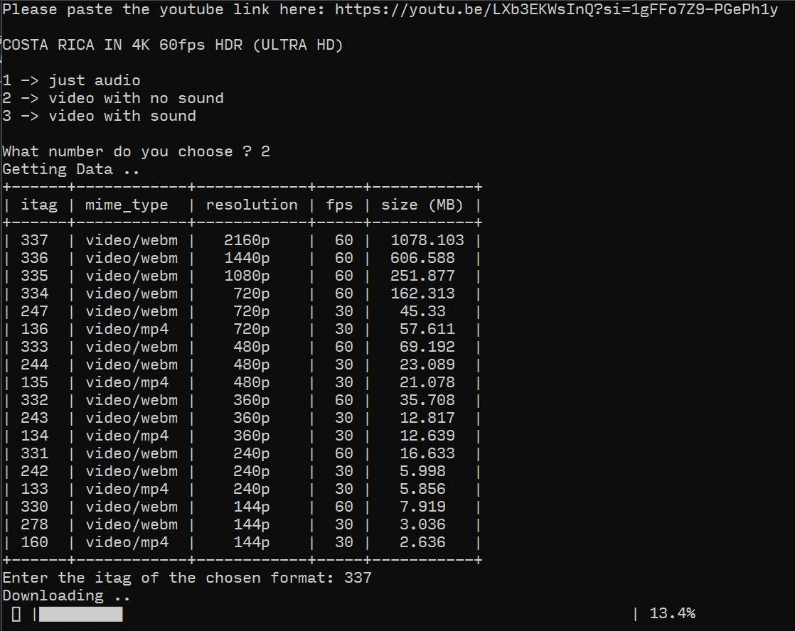
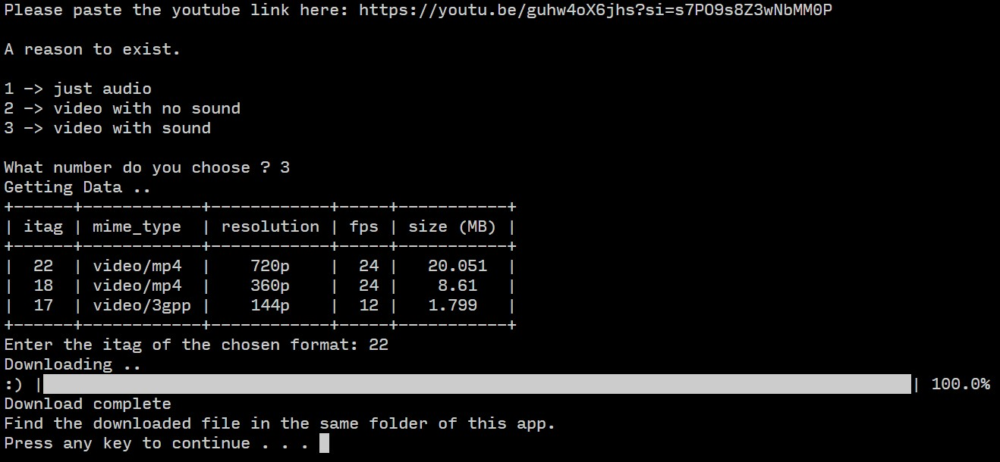

# YouTube Scraper 

A simple Pyhton program that takes a link of a YouTube video and downloads it.  
you can choose  
1 - File format (audio only / video without sound / video with sound)  
2 - Quality, resolution, or bitrate

## Demo

TODO: gif

## Installation

TODO: make this an executable app to be downloaded
    
## Screenshots
1

2

3

